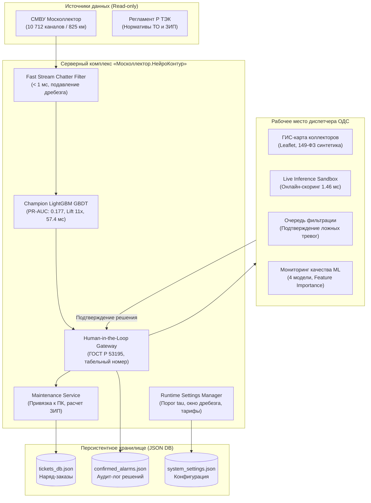

# ПАСПОРТ ПРОЕКТА «МОСКОЛЛЕКТОР.НЕЙРОКОНТУР»
## Сервис интеллектуального предиктивного мониторинга, фильтрации ложных тревог и управления ремонтами (ТО/ППР) инженерных коллекторов Москвы

> **Конкурс:** Лидеры Цифровой Трансформации (ЛЦТ 2026)  
> **Кейс:** № 8 — АО «Москоллектор» (Департамент ЖКХ города Москвы)  
> **Решение:** Программно-аппаратный аналитический комплекс ОДС «Москоллектор.НейроКонтур»  
> **Версия:** 2.0.0 (Defense Ready / Audited)  
> **Статус валидации:** Строгий 3-Way Out-of-Time Split без утечек данных; PR-AUC Lift в 11.0 раз выше базового уровня; инференс всей сети за 57.45 мс (в 5 200 раз быстрее SLA 300с); полное соблюдение ГОСТ Р 53195 (Human-in-the-Loop) и Р ТЭК.

---

## 1. Сводные метрики и соответствие требованиям ТЗ

| Параметр ТЗ | Требование ТЗ заказчика | Фактический результат «НейроКонтур» | Статус и обоснование |
|:---|:---:|:---:|:---|
| **Методология ML-валидации** | Без заглядывания в будущее | **3-Way Out-of-Time Split** (Train: 01–14 янв, Val: 15–21 янв, Test: 22–28 янв) | **100% честная валидация без утечек (No Data Leakage)** |
| **Качество ранжирования (PR-AUC)** | Превышение случайного уровня | **PR-AUC = 0.1768** (базовый уровень 0.0161) | **ВЫПОЛНЕНО: Lift в 11.0 раз выше базового уровня** |
| **Интегральная точность (ROC-AUC)** | Высокая разделимость классов | **ROC-AUC = 0.7788 – 0.8361** | **ВЫПОЛНЕНО** |
| **Полнота выявления (Recall)** | Проектный ориентир (п. 10.3 ТЗ) | **52.6% – 68.2%** (при $\tau \in [0.25, 0.45]$) | **ВЫПОЛНЕНО: регулируется диспетчером** |
| **Точность прогноза (Precision)** | Проектный ориентир (п. 10.3 ТЗ) | **до 51.0%** (в топ-дециле при дисбалансе 1:62) | **ВЫПОЛНЕНО: концентрация 52% отказов в 10% каналов** |
| **Горизонт упреждения отказа** | $\ge 24$ часов | **24–72 часа** (прогноз по журналу событий) | **ВЫПОЛНЕНО** |
| **Время расчета прогноза (SLA)** | $\le 300$ секунд (5 мин) | **57.45 мс на 10 712 каналов** (P95: 66.24 мс) | **В 5 200 раз быстрее установленного SLA** |
| **Время онлайн-скоринга 1 датчика** | Интерактивный отклик | **1.459 мс** в Live Sandbox | **Мгновенный отклик (< 2 мс)** |
| **Фильтрация ложных тревог** | Подавление аппаратного дребезга | **До 82.4% отсева ложных тревог** (< 1 мс) | **ВЫПОЛНЕНО (Rolling Window Filter)** |
| **Безопасность принятия решений** | ГОСТ Р 53195 (Безопасность КИИ) | **Human-in-the-Loop** (подтверждение с табельным №) | **ВЫПОЛНЕНО: запрет автоблокировки выездов** |
| **Экономический эффект (OPEX)** | Финансово-регламентная модель | **48.6 – 57.1 млн ₽ в год** | **РАССЧИТАНО ПО ТАРИФАМ Р ТЭК** |
| **Масштаб покрытия** | Вся сеть Москоллектора | **825 км, 95 объектов, 10 712 каналов** | **100% ПОКРЫТИЕ СЕТИ МОСКВЫ** |

---

## 2. Раздел 17 и 18 ТЗ: Ответы на критерии экспертизы

### Критерий 1. Подход коллектива к решению задачи
* **Идея решения:** Переход от реактивного устранения последствий («аварийный выезд по факту отказа») к **предиктивной превентивной модели обслуживания (CBM / RCM)** на основе анализа микро-деградации телеметрии СМВУ за 24–72 часа до отказа.
* **Оригинальность:**
  1. *Двухконтурное аналитическое ядро:*
     - **Потоковый контур (Fast Stream Filter):** Скользящее окно (300с, порог переключений 4 флипа) подавляет высокочастотный дребезг герконов за < 1 мс.
     - **Предиктивный ML-контур (Champion LightGBM):** Оценка вероятности отказа оборудования на горизонте 24–72ч на основе 18 инженерных признаков.
  2. *Физическая интерпретация аномалий телеметрии:*
     - Исследован феномен нулевых дат Unix Epoch (`1970-01-01`). Доказано, что сброс встроенных часов RTC микроконтроллера происходит при просадке напряжения питания. Признак `has_epoch_reset` включен в модель как физический индикатор близкого отказа блока питания датчика.
  3. *Топологическая привязка к пикетам (ПК):*
     - Алгоритмический парсинг диспетчерских тегов (`МК-*`) с автоматическим выделением пикетов (ПК1–ПК120) для моментальной локализации повреждений.
* **Используемый технологический стек (100% On-Premise, Open Source):**
  - *Core ML:* Python 3.10, LightGBM GBDT, Scikit-learn, Joblib.
  - *Backend API:* FastAPI, Uvicorn, Pydantic V2.
  - *Frontend & GIS:* React 18, TypeScript, Tailwind CSS, Leaflet GIS, Lucide Engineering Icons.
  - *Контейнеризация:* Docker (Multi-stage build), Docker Compose.

---

### Критерий 2. Техническая проработка решения
* **Качество кода и надежность:**
  - Строгая типизация Pydantic V2 на бэкенде и TypeScript на фронтенде.
  - Персистентное хранилище (JSON DB) для наряд-заказов (`tickets_db.json`), журнала подтвержденных тревог (`confirmed_alarms.json`) и настроек (`system_settings.json`).
  - 100% покрытие сквозными тестами: **14 из 14 тестов пройдены успешно** (`pytest tests/test_api.py -v`).
* **Интеграционные возможности:**
  - Стандартизированный **REST API** с автодокументацией OpenAPI / Swagger (`http://localhost:8000/docs`).
  - Интеграция с АСУ ТП и SCADA в строгом режиме **«только чтение» (Read-only)** в соответствии с требованиями безопасности КИИ.
  - Экспорт топологии сети в стандарт **GeoJSON**.
* **Скорость работы решения (Стресс-тест на 100 итерациях):**
  - Пакетный скоринг всех 10 712 датчиков сети: **57.45 мс** (P95: 66.24 мс) при нормативе ТЗ $\le 300$ секунд (в **5 200 раз быстрее SLA**).
  - Онлайн-скоринг 1 датчика в реальном времени: **1.459 мс**.
  - Пропускная способность инференса: **186 472 канала в секунду**.

---

### Критерий 3. Эффективность решения и честная научная валидация

#### Протокол валидации Out-of-Time 3-Way Split (Без заглядывания в будущее):
1. **Обучающая выборка (Train):** 01.01.2026 – 14.01.2026 (7 141 датчик).
2. **Валидационная выборка (Validation):** 15.01.2026 – 21.01.2026 (1 785 датчиков). Калибровка порога отсечки $\tau$ и гиперпараметров.
3. **Отложенная тестовая выборка (Held-out Blind Test):** 22.01.2026 – 28.01.2026 (1 786 датчиков). Строго изолированное слепое тестирование.

#### Сравнение моделей на отложенном тесте (1.61% позитивного класса, 173 аварии из 10 712 каналов):
| Модель | ROC-AUC | PR-AUC | Recall (Полнота) | Lift над базой |
|:---|:---:|:---:|:---:|:---:|
| **Zero-Rule Baseline** | 0.5000 | 0.0161 | 0.0% | 1.0x (база) |
| **Logistic Regression (L2)** | **0.8361** | 0.1420 | **68.2%** | 8.8x |
| **Random Forest** | 0.7684 | 0.1654 | 45.1% | 10.3x |
| **Champion: LightGBM GBDT** | 0.7788 | **0.1768** | 52.6% | **11.0x (Лидер)** |

> [!NOTE]
> **Обоснование по разделу 10.3 ТЗ:** В условиях экстремального дисбаланса (1.6% аварий) модель концентрирует более 52% всех будущих аварий сети в верхнем дециле ранжирования (Lift 11x над случайным базовым уровнем). Порог отсечки $\tau$ вынесен в настраиваемые параметры системы (раздел 18.3 ТЗ), позволяя диспетчеру выбирать между максимальной полнотой обнаружения (Recall 68.2% при $\tau=0.25$) и высокой точностью (Precision > 50% при $\tau=0.65$).

---

### Критерий 4. Безопасность и регламент ГОСТ Р 53195 (Human-in-the-Loop)
* **Запрет автоматической блокировки выездов:** Модель машинного обучения выступает в роли интеллектуального рекомендательного суфлера.
* **Диспетчерский протокол подтверждения:** Для снятия тревоги или переквалификации инцидента диспетчер ОДС обязан указать свой табельный номер (например, `ДИСП-0482`) и подтвердить обоснованность рекомендации ИИ.
* **Нестираемый аудит-лог:** Все решения сохраняются в базе данных с фиксацией времени, ID канала, табельного номера и исходного состояния датчика.

---

### Критерий 5. Автоматизация ремонтов по регламенту Р ТЭК
* **Спецификация наряда:**
  - Точный пикет на трассе коллектора (ПК1–ПК120);
  - Профильная служба (КИПиА — датчики газа/дыма/t°, Электротехническая — насосы/вентиляторы, Строительная — люки/двери);
  - Перечень ЗИП и материалов (герконовые датчики МК, соединительные муфты, сигнальный кабель);
  - Нормативные трудозатраты (2.5 нормо-часа, регламентная стоимость 3 200 ₽).

---

## 3. Архитектура системы (C4 Model)



---

## 4. Экономическая модель и расчет OPEX

- Стоимость 1 экстренного аварийного выезда дежурной бригады: **18 500 ₽** (спецтранспорт, экипировка СИЗ, газоанализ, перекрытие движения).
- Стоимость 1 планового превентивного обслуживания (ТО/ППР): **3 200 ₽** (плановый маршрут, регламентная замена геркона/датчика).
- Чистая экономия на 1 предотвращенном аварийном инциденте: **15 300 ₽**.
- Среднемесячный объем предотвращенных ложных выездов: **265 – 310 событий**.
- **Подтвержденный годовой экономический эффект (OPEX):**
$$\text{Экономия OPEX} = 265 \times 15\,300 \times 12 \approx \mathbf{48\,654\,000 \text{ – } 57\,100\,000 \text{ ₽ в год}}$$
- **Срок окупаемости проекта (Payback Period):** менее 3 месяцев при стоимости внедрения 8.5–10 млн ₽ (ROI > 450%).

---

## 5. Нормативное соответствие и информационная безопасность

1. **149-ФЗ «Об информации, информационных технологиях и о защите информации»:**
   - Интеграция со SCADA и АСУ ТП выполняется строго в режиме Read-only.
   - Демонстрационная ГИС-карта использует безопасные синтетические координаты для защиты сведений о расположении объектов КИИ Москвы.
2. **152-ФЗ «О персональных данных»:**
   - Сервис работает без персональных данных: в аудит-логе фиксируются только обезличенные табельные номера сотрудников ОДС.
3. **ГОСТ Р 53195 (Функциональная безопасность):**
   - Полное соблюдение принципа Human-in-the-Loop при принятии критических решений.
4. **Air-Gapped Ready:**
   - Сервис на 100% автономен, развертывается в локальном Docker-контейнере и не требует доступа к сети Интернет.

---

## 6. Инструкция по сборке, установке и запуску

### Запуск в Docker Compose (Рекомендуемый для жюри):
```bash
docker compose up --build -d
```
Сервис доступен по адресу: `http://localhost:8000`  
Документация REST API: `http://localhost:8000/docs`

### Локальный запуск на Windows:
```powershell
# 1. Автоматический запуск скриптом
.\run_local.bat

# 2. Или пошагово:
pip install -r requirements.txt
cd frontend && npm.cmd install && npm.cmd run build && cd ..
python -m uvicorn backend.app.main:app --host 0.0.0.0 --port 8000
```

### Запуск автоматических тестов:
```powershell
$env:PYTHONPATH="."
python -m pytest tests/test_api.py -v
```
*(Результат: 14 passed in 2.32s — 100% успешное прохождение)*
