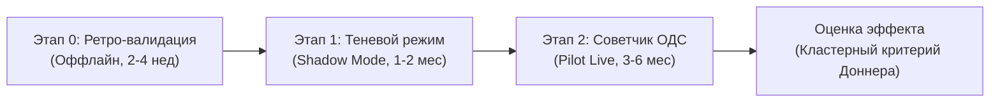

# Спецификация запроса производственных данных и методика ОПЭ «Москоллектор.НейроКонтур»

> [!NOTE]
> **Статус документа:** Проект научно-технической программы будущей опытно-промышленной эксплуатации (ОПЭ).
> Настоящий документ представляет собой проект научно-технической программы будущей опытно-промышленной эксплуатации, регламент запроса данных и методологический дизайн планируемого пилотного внедрения, а НЕ проведённый эксперимент. Все числовые нормативы, базовые доли и коэффициенты корреляции зафиксированы в качестве плановых рабочих гипотез, подлежащих обязательной калибровке на исторических данных АО «Москоллектор». Сроки подачи решений и регламент закрытия приёма определяются организаторами на официальной платформе чемпионата.

## 1. Констатация блокера исходных данных (Data Blocker Statement)

Во вводном датасете хакатона (архивы телеметрических логов за 2019–2026 гг.) содержатся физические показания датчиков (газовый состав, температура, уровни грунтовых вод, охранно-пожарная сигнализация), однако **полностью отсутствуют**:
1. Журналы инцидентов объединённой диспетчерской службы (ОДС) АО «Москоллектор».
2. Акты выполненных ремонтных работ CMMS / 1С:ТОИР с подтверждением физических отказов.
3. Документированные факты аварийных и ложных выездов дежурных бригад.
4. Официальная тарифная сетка себестоимости выездов и регламентного обслуживания.

В ходе коммуникации в официальном чате хакатона организаторы подтвердили наличие регламентных графиков (сообщение 462: *«есть и планово предупредительные работы... График запросим завтра уже»*), однако журналы ТОиР и фактические исходы предоставлены не были.

> [!IMPORTANT]
> **Принцип инженерной честности Vector:**
> Без ретроспективных актов ремонтов ни одна ML-модель не может доказать точность выявления реальных физических аварий или заявлять подтверждённую экономию OPEX. Целевые метки проекта «Москоллектор.НейроКонтур» построены строго алгоритмически по будущей телеметрии (proxy-positive) в отложенном временном окне без заглядывания в будущее (out-of-time test). Для перехода от прототипа к внедрению сформирована настоящая спецификация запроса данных и методика опытно-промышленной эксплуатации (ОПЭ).

---

## 2. Спецификация запроса данных (Data Request Specification)

Для проведения ретроспективной валидации и настройки промышленного контура у заказчика запрашивается выгрузка деперсонализированных данных за ретроспективный период 12–24 месяца по следующим 4 сущностям.

### Таблица 1: Журнал инцидентов и вызовов диспетчерской службы (ОДС)

| Поле | Тип данных | Обязательность | Описание и назначение |
|---|---|:---:|---|
| `incident_id` | String / UUID | Да | Уникальный номер инцидента в АСУ Диспетчеризации |
| `timestamp_created` | ISO 8601 (UTC+3) | Да | Метка времени фиксации сигнала в системе |
| `object_id` | Integer | Да | Идентификатор коллектора / РУ в номенклатуре Москоллектора |
| `picket_code` | String | Да | Привязка к трассе и пикетажу (например, `ПК 14+50`) |
| `channel_id` | Integer | Да | Идентификатор канала СМВУ, вызвавшего сигнал |
| `signal_type` | Enum | Да | `GAS_CH4`, `GAS_CO2`, `TEMP_ANOMALY`, `WATER_LEVEL`, `SECURITY` |
| `dispatcher_action` | Enum | Да | `ACCEPTED_DISPATCH`, `DISMISSED_NOISE`, `MAINTENANCE_QUEUED` |
| `dispatch_timestamp` | ISO 8601 | Нет | Метка времени отправки аварийной бригады |
| `arrival_timestamp` | ISO 8601 | Нет | Метка времени прибытия на объект (расчёт времени доезда) |
| `actual_resolution` | Enum | Да | `CONFIRMED_ACCIDENT`, `EQUIPMENT_FAULT`, `FALSE_ALARM`, `EXTERNAL_FACTOR` |
| `is_verified_false_alarm`| Boolean | Да | **Ключевая целевая метка ground-truth:** подтверждённая ложная тревога |

### Таблица 2: Реестр нарядов и актов выполненных работ (CMMS / 1С:ТОИР)

| Поле | Тип данных | Обязательность | Описание и назначение |
|---|---|:---:|---|
| `work_order_id` | String | Да | Номер наряда-допуска / акта ТОиР |
| `related_incident_id` | String | Нет | Связь с инцидентом ОДС (если выезд по аварии) |
| `equipment_kks` | String | Да | KKS-код оборудования или секции кабельного коллектора |
| `work_type` | Enum | Да | `EMERGENCY` (аварийный), `PPR` (плановый), `INSPECTION` (осмотр) |
| `time_start` / `time_end`| ISO 8601 | Да | Интервал проведения работ бригадой на объекте |
| `materials_spec` | JSON Array | Да | Перечень ЗИП: `[{"sku": "...", "name": "...", "qty": 1, "cost": 0.0}]` |
| `man_hours` | Float | Да | Суммарные трудозатраты бригады (человеко-часы) |
| `total_cost_rub` | Decimal | Да | Фактическая подтверждённая себестоимость закрытия наряда |
| `defect_description` | Text | Да | Дефектовочная ведомость (причина отказа, износ изоляции, залитие) |

### Таблица 3: Тарифная сетка и нормативные ставки затрат

| Параметр | Единица измерения | Назначение для финансовой модели |
|---|:---:|---|
| Себестоимость аварийного выезда бригады ОДС | руб. / выезд | Базовый норматив предотвращённых прямых затрат ($C_{\text{авар}}$) |
| Себестоимость планового технического осмотра | руб. / выезд | Норматив предиктивного регламентного обслуживания ($C_{\text{план}}$) |
| Стоимость часа простоя кабельной линии 110/220 кВ | руб. / час | Косвенный ущерб и предотвращённый недоотпуск электроэнергии |
| Нормативный SLA реагирования ОДС по регламенту | мин. / сек. | Контрольный норматив быстродействия системы (в ТЗ — 300 с) |

### Таблица 4: Паспорта каналов и топологическая модель (GIS)

| Поле | Тип данных | Описание |
|---|---|---|
| `channel_id` | Integer | Идентификатор канала СМВУ |
| `geo_wkt` | WKT / GeoJSON | Геометрия трассы коллектора (с соблюдением режима ДСП/КТ) |
| `cable_voltage_kv` | Integer | Класс напряжения силовых кабелей в отсеке (10, 20, 110, 220 кВ) |
| `depth_meters` | Float | Глубина заложения секции коллектора |
| `ventilation_zone_id` | Integer | Привязка к вентиляционной шахте и зоне принудительного воздухообмена |

---

## 2.1. Таксономия доказательств и статус данных (Data & Evidence Taxonomy)

Для исключения двусмысленности в проектных материалах зафиксировано строгое четырёхчастное разделение всех используемых метрик, оценок и утверждений:

| Категория статуса | Что входит в проекте | Источник и способ проверки | Пределы интерпретации |
|---|---|---|---|
| **1. Реально измерено** | • Оценки моделей на отложенном тесте (`PR-AUC 0,1679`, `ROC-AUC 0,7710`). • Задержка инференса парка 11 485 каналов (`62,86 мс`, P95 `70,65 мс`). • Скоринг одного канала (`1,498 мс`). • HTTP loopback benchmark (`111,3 RPS`, P50 `171,76 мс`). • Тестовый контур backend (`52/52` теста API, калибровки и синтетического пайплайна). | `backend/models/metrics_report.json`, вывод `pytest tests/ -v`. | Воспроизводимые замеры на локальном тестовом стенде. Не являются гарантией пропускной способности каналов заказчика. |
| **2. Проверено на proxy-метках** | • 174 целевых события в окне 24–72 ч, размеченных алгоритмически по будущим физическим выходам параметров телеметрии. • Сверка прогнозов и меток в `backend/data/reconciliation_ground_truth.json` с трассировкой до строк исходной телеметрии. | Генератор `scripts/build_reconciliation_json.py`, исходный журнал телеметрии `ext-journal-2026.csv`. | Proxy-positive подтверждает алгоритмическое совпадение с будущим поведением сенсоров, но НЕ является подтверждённым актом аварии или ремонтом. |
| **3. Сценарное допущение** | • Нормативы затрат: аварийный выезд `18 500 ₽` vs плановое ТО `3 200 ₽`. • Диапазон предотвращённых инцидентов: `230–310 выездов/мес`. • Иллюстративный годовой экономический эффект: `42,2–56,9 млн ₽/год`. | Расчётная финансовая модель в `PROJECT_PASSPORT.md` и на слайде 14 презентации. | Нормативно-сценарная модель (18 500 ₽ выезд vs 3 200 ₽ ТО) для демонстрации окупаемости. Не является фактом подтверждённой экономии: фактический эффект требует данных 1С:ТОИР и подтверждённых исходов выездов ОДС АО «Москоллектор». |
| **4. Нужны данные заказчика** | • Ретроспективные журналы ОДС АО «Москоллектор» с исходами выездов. • Акты ТОиР из 1С:ТОИР / CMMS с реальной себестоимостью ремонтов. • Утверждённая нормативная сетка затрат заказчика. • Паспорта и пространственная топология коллекторов с пикетажем. • Корпоративный каталог AD / FreeIPA для RBAC. | Запрашиваются по спецификации раздела 2 настоящего документа для этапов 0–1 ОПЭ. | Без этих данных переход в промышленную эксплуатацию и фиксация экономической эффективности невозможны. |

---

## 3. Методика опытно-промышленной эксплуатации (Методика ОПЭ)

Программа и методика проведения опытно-промышленной эксплуатации программного комплекса «Москоллектор.НейроКонтур» в инфраструктуре заказчика разделена на 3 последовательных этапа.

### Этап 0: Ретроспективная калибровка моделей (Offline Validation)
- **Цель:** Обучение и калибровка ансамбля моделей на исторических данных с верификацией по актам CMMS/1С:ТОИР за последние 12 месяцев.
- **Вход:** Данные СМВУ + сопоставленные акты ТОиР и журналы ОДС.
- **Критерии перехода на Этап 1:**
  - $\text{ROC-AUC} \ge 0.78$ на отложенной выборке (out-of-time);
  - $\text{PR-AUC Lift} \ge 8.0\times$ к априорной вероятности отказа;
  - $\text{Recall} \ge 65\%$ при $\text{Precision} \ge 18\%$ на рабочем пороге отсечки $\tau$;
  - Отсутствие утечек данных (Data Leakage) при расчёте скользящих агрегатов.

### Этап 1: Теневой режим (Shadow Mode / Silent Evaluation)
- **Цель:** Проверка инференса в режиме реального времени без влияния на оперативный персонал.
- **Реализация:** Прототип подключается к брокеру сообщений СМВУ (Kafka / MQTT / RabbitMQ) в режиме `read-only`.
- **Процесс:**
  1. Сервис выполняет потоковый скоринг 11 485 каналов с фиксацией времени задержки (SLA $\le 300$ с).
  2. Все сгенерированные скоринги и предупреждения записываются в изолированный аудит-лог с меткой времени.
  3. Диспетчеры работают по штатным регламентам без доступа к рекомендациям прототипа.
  4. По итогам каждого месяца рабочая группа проводит слепую сверку: сопоставляются зафиксированные прототипом предупреждения и реальные факты выездов ОДС и аварийных нарядов.
- **Критерии перехода на Этап 2:**
  - $P95$ задержки инференса на всем парке каналов $< 1.0$ с;
  - Доступность сервиса (Uptime) $\ge 99.9\%$;
  - Подтверждённое опережение фиксации деградации признаков относительно аварийного сигнала СМВУ минимум на 4 часа в $\ge 50\%$ случаев.

### Этап 2: Режим «Советчик диспетчера» (Human-in-the-Loop Pilot)
- **Цель:** Оценка эргономики интерфейса, удобства работы диспетчеров ОДС и верификация гипотезы о снижении доли ложных выездов.
- **Реализация:**
  1. В диспетчерском пункте ОДС разворачивается рабочее место «НейроКонтур».
  2. При возникновении предвестников инцидента на экран диспетчера выводится рекомендательная карточка: скоринг риска, топ-3 фактора телеметрии (SHAP-атрибуция), пикет и предлагаемый комплект ЗИП.
  3. **Принцип главенства человека:** Диспетчер вправе подтвердить рекомендацию (оформить наряд на осмотр) либо отклонить её, указав причину (дребезг, плановые работы, внешний фактор).
  4. Все действия диспетчера логируются с криптографическим хэшированием сессий.

---

## 4. Протокол статистической оценки экономического эффекта и методология ОПЭ

Для исключения субъективных оценок и защиты инвестиций внедрения подтверждение эффективности производится по строгому математическому протоколу клинико-инженерного типа.

### 4.1. Критерии формирования когорты участков (Inclusion / Exclusion Criteria)

- **Критерии включения (Inclusion):**
  1. Линейные участки кабельных и коммуникационных коллекторов глубокого заложения ($\ge 3$ м) с силовыми кабелями 10–220 кВ.
  2. Оснащение штатным комплексом датчиков СМВУ (газоанализ метан/угарный газ, термометрия, датчики затопления, охранная сигнализация).
  3. Наличие непрерывного архива телеметрических логов за предшествующие $\ge 12$ месяцев без пропусков $> 5\%$ времени.
- **Критерии исключения (Exclusion):**
  1. Участки коллекторов, находящиеся на плановой реконструкции или капитальном ремонте.
  2. Секции с нестабильным каналом связи верхнего уровня (Packet Loss $> 5\%$, частые таймауты телеметрии).
  3. Участки без резервирования датчиков критических газов ($\text{CH}_4$, $\text{CO}$).

### 4.2. Кластерная рандомизация (Cluster Allocation)

Во избежание взаимного влияния (spillover effect) и пространственной корреляции смежных датчиков единицей рандомизации выбирается не отдельный канал или пикет, а **обособленный кластер** (участок коллектора между двумя вентиляционными шахтами или распределительными узлами длиной 500–1500 м).

- **Группа A (Пилотная):** участки, мониторинг которых ведётся с применением комплекса «НейроКонтур» в режиме «советчик диспетчера ОДС» (с выдачей карточки риска, факторов аномалии и рекомендации ЗИП).
- **Группа B (Контрольная):** участки со стандартным регламентным реагированием диспетчера по штатным порогам СМВУ.
- **Балансировка:** Группы A и B стратифицируются по суммарной протяжённости (км), плотности кабельных линий 110/220 кВ и базовой исторической частоте сработок за предыдущий год.

### 4.3. Единицы анализа (Units of Analysis)

1. **Первичная единица анализа:** Зарегистрированный вызов / выезд аварийной бригады ОДС по сигналу СМВУ с верифицированным исходом по акту закрытия (подтверждённая авария vs подтверждённая ложная тревога).
2. **Вторичная единица анализа:** Кластер-месяц эксплуатации (удельное число ложных выездов на 10 км трассы в месяц).

### 4.4. Расчёт мощности и необходимого объёма выборки (Sample Size & Power Calculation)

> [!IMPORTANT]
> **Плановые гипотезы методики (требуют калибровки):**
> Значения $p_0 = 0.40$ (базовая доля ложных выездов), $p_1 = 0.25$ (ожидаемая доля в пилотной группе), коэффициент внутрикластерной корреляции $\text{ICC} = \rho = 0.03$ и интенсивность 70–80 выездов/месяц являются **плановыми гипотезами методики, требующими калибровки на исторических данных АО «Москоллектор»** на подготовительном этапе 0 (ретроспективный анализ журналов ОДС).

Для обеспечения доказательной силы исследования объём выборки рассчитывается исходя из проверки двусторонней статистической гипотезы для бинарного исхода с учётом кластерного рандомизированного дизайна:
- Базовая доля ложных выездов в контрольной группе (плановая гипотеза): $p_0 = 0.40$ (40%);
- Ожидаемая доля ложных выездов в пилотной группе (плановая гипотеза): $p_1 = 0.25$ (25%);
- Минимальный клинически/экономически значимый эффект: $\Delta = |p_0 - p_1| = 0.15$;
- Ошибка I рода: $\alpha = 0.05$ (двусторонняя);
- Статистическая мощность: $1 - \beta = 0.80$ ($Z_{\beta} = 0.842$).

Формула расчёта размера некоррелированной выборки:
$$n_{\text{uncorr}} = \frac{\left( Z_{\alpha/2}\sqrt{2\bar{p}(1-\bar{p})} + Z_{\beta}\sqrt{p_0(1-p_0) + p_1(1-p_1)} \right)^2}{(p_0 - p_1)^2}$$
Где $\bar{p} = \frac{p_0 + p_1}{2} = 0.325$, $Z_{\alpha/2} = 1.960$.
$$n_{\text{uncorr}} \approx 152 \text{ выезда на каждую группу}.$$

С учётом кластерного дизайна применяется фактор инфляции дисперсии (Variance Inflation Factor, VIF / Design Effect):
$$\text{VIF} = 1 + (m - 1)\rho$$
При среднем числе выездов на кластер $m = 15$ и коэффициенте внутрикластерной корреляции (ICC) $\rho = 0.03$ (плановая гипотеза):
$$\text{VIF} = 1 + (15 - 1) \times 0.03 = 1 + 0.42 = 1.42$$
Скорректированный объём выборки:
$$N_{\text{adj}} = n_{\text{uncorr}} \times \text{VIF} \approx 152 \times 1.42 \approx 216 \text{ выездов на группу (всего } \ge 432 \text{ выезда)}.$$
При плановой интенсивности 70–80 выездов ОДС в месяц на пилотном полигоне (требующей калибровки по архивам АО «Москоллектор») необходимый срок набора выборки составляет **6 месяцев**.

### 4.5. Предопределённые конечные точки (Prespecified Endpoints)

- **Первичная конечная точка (Primary Endpoint):** Доля подтверждённых ложных выездов бригад ОДС за 6 месяцев наблюдения, рассчитываемая как:
  $$p_{\text{ложных}} = \frac{N_{\text{ложных выездов}}}{N_{\text{всех выездов бригад ОДС}}}$$
- **Вторичные конечные точки (Secondary Endpoints):**
  1. **Абсолютная частота ложных выездов на кластер в месяц** ($\lambda_{\text{ложных}}^{(k)} = \frac{N_{\text{ложных}}^{(k)}}{T_{\text{мес}}^{(k)}}$) — показатель абсолютного снижения нагрузки на дежурные бригады ОДС на единицу протяжённости коллектора в единицу времени независимо от общего объёма вызовов.
  2. Время опережения фиксации деградации телеметрии (Lead Time) относительно аварийного срабатывания порога СМВУ (целевое значение: $\ge 4$ часов в $\ge 50\%$ случаев).
  3. Среднее время обработки карточки инцидента диспетчером ОДС (сокращение времени верификации за счёт контекстной подсказки факторов риска).
  4. Доля предотвращённых аварийных переходов изоляции силовых кабелей (по данным планово-предупредительных ремонтов).

### 4.6. Протокол проверки гипотезы (Кластерно-скорректированный критерий Доннера / Donner's Test)

Поскольку рандомизация выполняется по пространственным кластерам (участкам коллекторов), а наблюдения проводятся по отдельным выездам, стандартный независимый Z-тест приводит к занижению дисперсии и ложноположительным выводам (инфляция ошибки I рода). Для корректного анализа применяется **кластерно-скорректированный критерий хи-квадрат Доннера (Donner's cluster-adjusted test)** и метод обобщённых оценочных уравнений (GEE):

$$H_0: p_{\text{ложных}}^{(A)} = p_{\text{ложных}}^{(B)} \quad (\text{«НейроКонтур» не снижает долю ложных выездов})$$
$$H_1: p_{\text{ложных}}^{(A)} < p_{\text{ложных}}^{(B)} \quad (\text{доля ложных выездов статистически значимо снижена})$$

Статистика критерия Доннера с поправкой на внутрикластерную корреляцию (ICC $\hat{\rho}$):
$$X^2_{\text{adj}} = \frac{X^2_{\text{Pearson}}}{C_{\text{adj}}}$$
где $X^2_{\text{Pearson}}$ — классический критерий Пирсона, а $C_{\text{adj}}$ — поправочный коэффициент инфляции дисперсии выборки:
$$C_{\text{adj}} = 1 + (\bar{m} - 1)\hat{\rho}$$

В эквивалентной односторонней Z-формулировке с кластерной поправкой:
$$Z_{\text{adj}} = \frac{\hat{p}_B - \hat{p}_A}{\sqrt{\hat{p}(1 - \hat{p})\left(\frac{C_A}{n_A} + \frac{C_B}{n_B}\right)}}$$
Где $\hat{p} = \frac{x_A + x_B}{n_A + n_B}$, $C_A = 1 + (\bar{m}_A - 1)\hat{\rho}$, $C_B = 1 + (\bar{m}_B - 1)\hat{\rho}$.
При $Z_{\text{adj}} > 1.645$ ($p\text{-value} < 0.05$ для односторонней гипотезы $H_1$) нулевая гипотеза отвергается с доверительной вероятностью $95\%$.

Для анализа вторичной конечной точки (абсолютная частота ложных выездов на кластер-месяц $\lambda_{\text{ложных}}$) применяется **модель GEE (Generalized Estimating Equations)** с лог-линейной связью (квази-Пуассон), учитывающая гетерогенность кластеров и робастную кластерную ковариационную матрицу (Huber-White cluster-robust sandwich estimator).

### 4.7. Расчёт фактической подтверждённой чистой экономии (Cost & TCO Evaluation)

> [!WARNING]
> **Принципиальное методологическое разграничение:**
> Кластерно-скорректированный статистический тест доказывает исключительно статистическую значимость снижения доли событий, но **НЕ является доказательством финансовой экономии**.
> Экономический эффект (42,2–56,9 млн ₽/год) — это нормативно-сценарная модель (18 500 ₽ экстренный выезд vs 3 200 ₽ регламентное ТО при 230–310 предотвращённых инцидентах в месяц) для демонстрации потенциала окупаемости, а фактический эффект требует данных 1С:ТОИР и подтверждённых исходов выездов ОДС АО «Москоллектор» за вычетом совокупной стоимости владения (TCO).
> Фактический денежный эффект рассчитывается исключительно методом прямого сопоставления подтверждённых затрат по закрытым нарядам 1С:ТОИР за вычетом совокупной стоимости владения (TCO):

$$\text{Net Savings} = \sum_{i=1}^{M_{\text{предотвращ}}} \left( C_{\text{авар}}^{(i)} - C_{\text{план}}^{(i)} \right) - \text{TCO}_{\text{системы}}$$

Где:
- $M_{\text{предотвращ}}$ — подтверждённое число дефектов, локализованных плановым осмотром до аварийного отказа;
- $C_{\text{авар}}^{(i)}$ — фактическая себестоимость ликвидации $i$-й аварии по закрытому акту 1С:ТОИР;
- $C_{\text{план}}^{(i)}$ — подтверждённая себестоимость предиктивного регламентного наряда;
- $\text{TCO}_{\text{системы}} = \text{CAPEX}_{\text{амортиз}} + \text{OPEX}_{\text{сопровождения}} + C_{\text{обучение}} + C_{\text{инфраструктура}}$:
  - $\text{CAPEX}$: серверная инфраструктура в контуре КИИ, сертифицированный диод данных, пусконаладочные работы;
  - $\text{OPEX}$: техническая поддержка ПО, обновления моделей, сопровождение сетевой изоляции.

---

## 5. Требования к информационной безопасности и контуру КИИ

Комплекс коллекторного хозяйства города Москвы относится к критической информационной инфраструктуре (КИИ) Российской Федерации. Интеграция программного комплекса «НейроКонтур» регламентируется требованиями:
- **187-ФЗ** «О безопасности критической информационной инфраструктуры РФ»;
- **149-ФЗ** «Об информации, информационных технологиях и о защите информации»;
- **152-ФЗ** «О персональных данных»;
- Приказов ФСТЭК России № 235 и № 239 (для значимых объектов КИИ 2-й и 3-й категории).

### Архитектурные требования безопасности
1. **Сетевая изоляция технологического сегмента:**
   - Прямое подключение аналитического сервера к контроллерам нижнего уровня СМВУ категорически запрещено.
   - Сбор телеметрии осуществляется через сертифицированный программно-аппаратный диод данных (Data Diode) или демилитаризованную зону (DMZ) SCADA-системы с однонаправленной передачей данных.
2. **Идентификация и контроль доступа:**
   - Интеграция с корпоративной службой каталогов заказчика (Active Directory / FreeIPA) по защищённым протоколам Kerberos / LDAPS / OpenID Connect.
   - Двухфакторная аутентификация (2FA) для всех рабочих мест диспетчеров и администраторов.
   - Ролевая модель разграничения прав (RBAC): Оператор ОДС, Старший диспетчер, Инженер ТОиР, Администратор безопасности.
3. **Целостность и аудит:**
   - Ведение неизменяемого журнала аудита (Audit Trail) всех решений операторов с вычислением криптографических хэш-сумм SHA-256.
   - Передача событий безопасности в корпоративный центр мониторинга (SOC / SIEM заказчика) по протоколу Syslog / CEF.
4. **Импортозамещение:**
   - Стек ПО построен на открытых компонентах с возможностью включения в Единый реестр российских программ (Python, PostgreSQL/ClickHouse, Linux Astra Linux / РЕД ОС).
